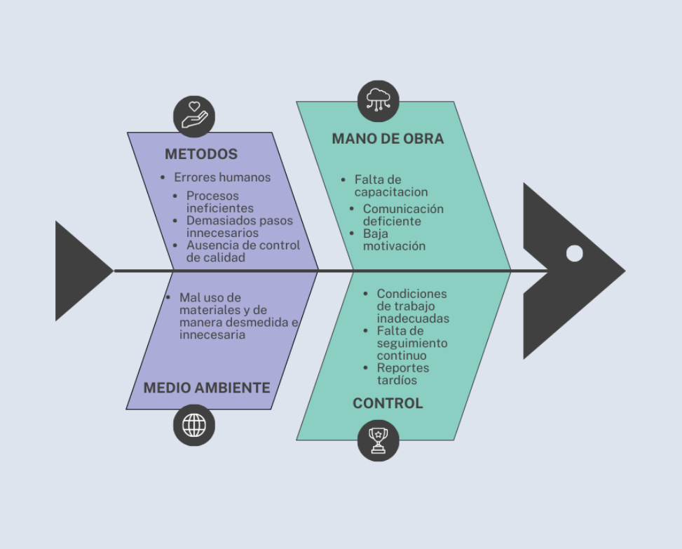

# Gestor de Inventario para Pequeños Negocios

### Problema identificado:
Muchos pequeños negocios aún llevan el control de su inventario en cuadernos o en hojas de cálculo básicas. Esto genera errores frecuentes, pérdida de información y dificultad para conocer el estado real de sus productos, ocasionando desabastecimiento o sobrecompra.

### Objetivo general:
Diseñar y desarrollar un sistema de gestión de inventario que permita a pequeños negocios registrar, consultar y controlar de forma eficiente sus productos y ventas.

### Objetivos específicos:
Permitir el registro y actualización de productos con información básica (nombre, código, precio, proveedor, cantidad).
Facilitar el registro de ventas para que el sistema actualice automáticamente el stock.
Generar alertas cuando los productos lleguen a un nivel mínimo de inventario.
Ofrecer reportes básicos de stock y movimientos de productos.

### Usuarios principales:
Administrador o dueño del negocio.
Empleados responsables del manejo de inventario.

### Requerimientos iniciales:
Registro, edición y eliminación de productos.
Registro de ventas y actualización automática de inventario.
Consulta de productos disponibles y búsqueda rápida.
Generación de reportes simples de inventario.
Alertas de stock mínimo.

Con esta propuesta, el proyecto busca resolver un problema real de organización y control en pequeños negocios, aportando eficiencia y confiabilidad en el manejo de inventarios.

## Diagrama de Ishikawa

## Diagrama de Flujo

### Historias de usuario

## Registrar Producto

Como administrador del negocio, quiero registrar nuevos productos con su nombre, código, precio, proveedor y cantidad,
para tener un control inicial del inventario y evitar pérdidas de información.

Criterios de aceptación:
Todos los campos deben ser obligatorios.
El código debe ser único.
El producto debe almacenarse correctamente en la base de datos.

## Editar Producto

Como administrador, quiero poder editar la información de un producto existente,
para mantener los datos actualizados cuando cambie el precio, proveedor o stock.

Criterios de aceptación:
Solo usuarios autorizados pueden editar.
Los cambios deben guardarse correctamente.
El código del producto no debe duplicarse.

## Eliminar Producto

Como administrador, quiero eliminar productos que ya no se manejan en el negocio,
para mantener un inventario limpio y actualizado.

Criterios de aceptación:
No debe permitir eliminar productos con historial de ventas.
La eliminación debe reflejarse en la base de datos sin errores.

## Registrar Venta

Como empleado o administrador, quiero registrar cada venta realizada,
para que el sistema actualice automáticamente el stock de los productos vendidos.

Criterios de aceptación:
Solo se pueden registrar productos existentes.
Si no hay stock suficiente, el sistema debe mostrar una alerta.
El stock debe disminuir correctamente tras cada venta.

## Generar Reporte de Inventario

Como administrador, quiero generar reportes de inventario y movimientos de productos,
para tener una visión clara del stock disponible y las ventas realizadas.

Criterios de aceptación:
El sistema debe permitir filtrar por fecha o producto.
El reporte debe poder exportarse a PDF o Excel.

## Alerta de Stock Mínimo

Como administrador, quiero recibir alertas cuando un producto llegue a su nivel mínimo de inventario,
para realizar pedidos a tiempo y evitar el desabastecimiento.

Criterios de aceptación:
Cada producto debe tener definido su stock mínimo.
La alerta debe ser visible en el panel principal o por correo.

## Buscar Producto

Como empleado,quiero buscar productos por nombre o código,
para encontrarlos rápidamente al momento de registrar una venta o revisar el inventario.

Criterios de aceptación:
El buscador debe mostrar coincidencias parciales.
La búsqueda debe ser rápida y precisa.

## Control de Stock Automático

Como administrador, quiero que el sistema actualice automáticamente el inventario cada vez que se realice una venta o edición,
para evitar errores de conteo manual.

Criterios de aceptación:
Las actualizaciones deben reflejarse en tiempo real.
Debe registrar cada movimiento en un historial.

## Gestión de Usuarios

Como administrador, quiero registrar y controlar el acceso de los empleados al sistema,
para garantizar que solo el personal autorizado pueda modificar o registrar información.

Criterios de aceptación:
El sistema debe permitir crear usuarios con roles (Administrador, Empleado).
Los permisos deben restringir acciones según el rol asignado.

## Generar Historial de Movimientos

Como administrador, quiero consultar un historial de movimientos del inventario (entradas, ventas, ediciones),
para tener trazabilidad y control de todas las acciones realizadas.

Criterios de aceptación:
El sistema debe mostrar fecha, usuario y tipo de acción.
Debe permitir exportar o filtrar el historial.
