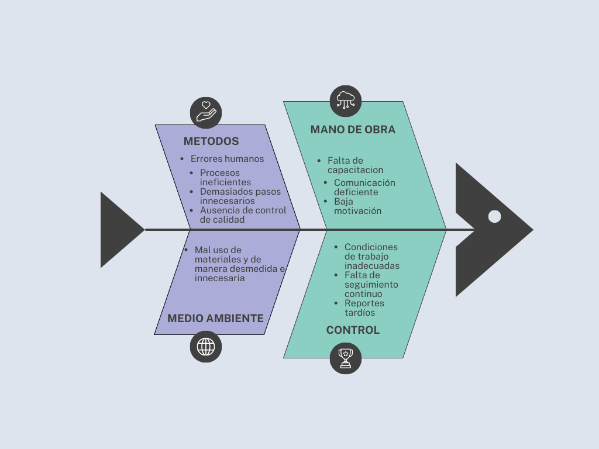

# Gestor de Inventario para Pequeños Negocios

### Problema identificado:
Muchos pequeños negocios aún llevan el control de su inventario en cuadernos o en hojas de cálculo básicas. Esto genera errores frecuentes, pérdida de información y dificultad para conocer el estado real de sus productos, ocasionando desabastecimiento o sobrecompra.

### Objetivo general:
Diseñar y desarrollar un sistema de gestión de inventario que permita a pequeños negocios registrar, consultar y controlar de forma eficiente sus productos y ventas.

### Objetivos específicos:
Permitir el registro y actualización de productos con información básica (nombre, código, precio, proveedor, cantidad).
Facilitar el registro de ventas para que el sistema actualice automáticamente el stock.
Generar alertas cuando los productos lleguen a un nivel mínimo de inventario.
Ofrecer reportes básicos de stock y movimientos de productos.

### Usuarios principales:
Administrador o dueño del negocio.
Empleados responsables del manejo de inventario.

### Requerimientos iniciales:
Registro, edición y eliminación de productos.
Registro de ventas y actualización automática de inventario.
Consulta de productos disponibles y búsqueda rápida.
Generación de reportes simples de inventario.
Alertas de stock mínimo.

Con esta propuesta, el proyecto busca resolver un problema real de organización y control en pequeños negocios, aportando eficiencia y confiabilidad en el manejo de inventarios.

## Diagrama de Ishikawa

## Diagrama de Flujo

